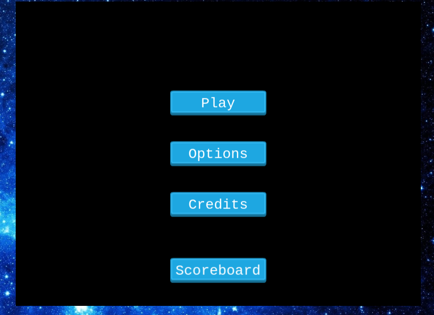
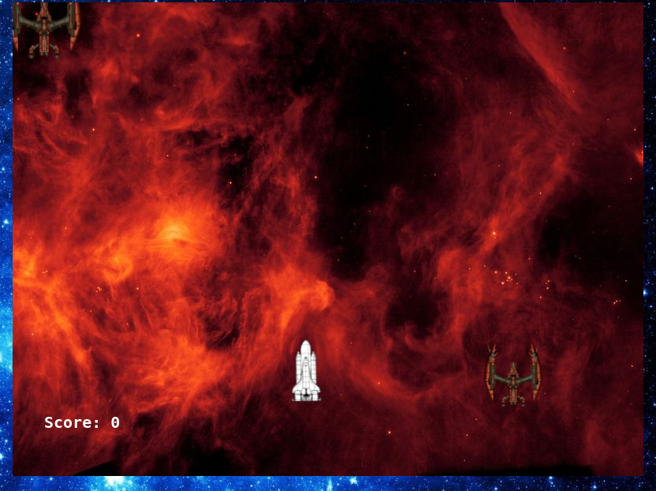

# Space-Shooter

A space shooter game build with Phaser 3, javascript and webpack, this project is a capstone project for the javascript curriculum of microverse

## Main menu

## Game scenario:

[Check my Game Design Document] (https://github.com/Oxford-G/Space-Shooter/blob/feature-branch/GDD.md)

## Built With

- HTML
- JAVASCRIPT
- PHASER 3
- NPM
- WEBPACK
- Babel
- JEST

## Live link

[live link](https://oxy-space-shooter-game.netlify.app)

## How to Play
Input your name on the first page and click the submit button, There is a menu on the next page which are Play, Options, Credits and Scoreboard. You can disable the sound in the options menu. Click on the play menu to start your game. You can move around the screen using W, S, D, and A keys and use the Space Bar to shoot whenever you see an enemy.

# Do you want to clone?
## Getting Started

- Go to your terminal
- Put git clone `git@github.com:Oxford-G/Space-Shooter.git`
- Go to the project folder with cd `Space-Shooter`

## Setup

- Inside the project folder
- Run `npm install`
- Run `npm start`
- On your browser, make sure you point to the right address (i.e: http://localhost:8080/)

## Run tests

- Run `npm test` to run all the tests.

## Author

👤 **Enekwechi Chinonso Gerald**

- GitHub: [@Oxford-G](https://github.com/Oxford-G)
- Twitter: [@OXFORD2](https://twitter.com/OXFOXD2)
- Linkedin: [Enekwechi Chinonso G](https://www.linkedin.com/in/chinonso-enekwechi)

## 🤝 Contributing

Contributions, issues, and feature requests are welcome!

## Show your support

Give a ⭐️ if you like this project!

## Acknowledgments

- Microverse
- Phaser
- OpenGameArt

## 📝 License

MIT License Copyright (c) 2021 Andres Ortegon Permission is hereby granted, free of charge, to any person obtaining a copy of this software and associated documentation files (the "Software"), to deal in the Software without restriction, including without limitation the rights to use, copy, modify, merge, publish, distribute, sublicense, and/or sell copies of the Software, and to permit persons to whom the Software is furnished to do so, subject to the following conditions: The above copyright notice and this permission notice shall be included in all copies or substantial portions of the Software. THE SOFTWARE IS PROVIDED "AS IS", WITHOUT WARRANTY OF ANY KIND, EXPRESS OR IMPLIED, INCLUDING BUT NOT LIMITED TO THE WARRANTIES OF MERCHANTABILITY, FITNESS FOR A PARTICULAR PURPOSE AND NONINFRINGEMENT. IN NO EVENT SHALL THE AUTHORS OR COPYRIGHT HOLDERS BE LIABLE FOR ANY CLAIM, DAMAGES OR OTHER LIABILITY, WHETHER IN AN ACTION OF CONTRACT, TORT OR OTHERWISE, ARISING FROM, OUT OF OR IN CONNECTION WITH THE SOFTWARE